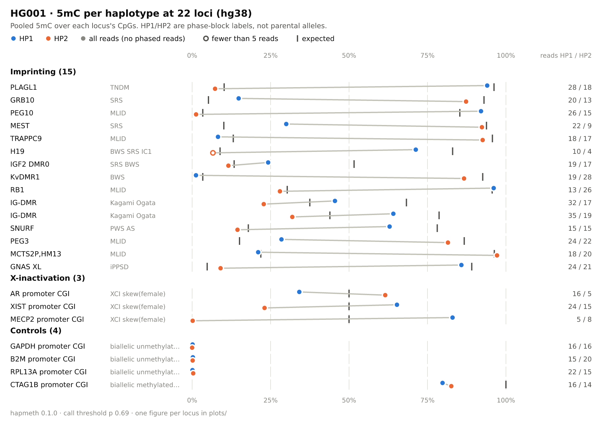
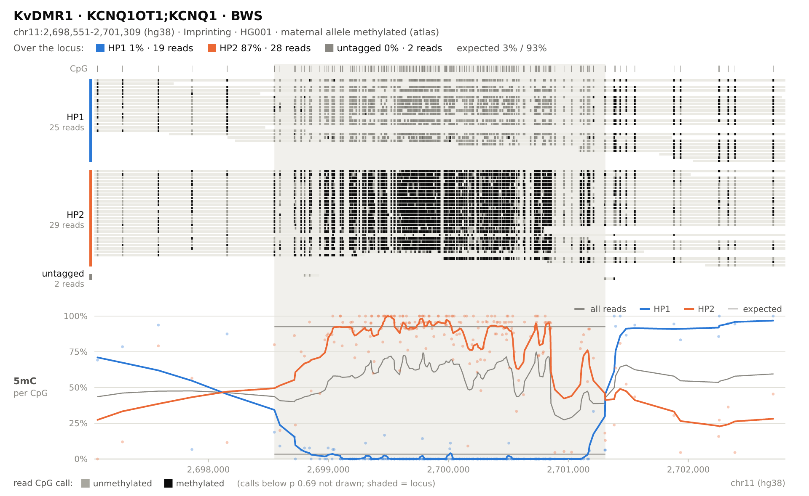

# hapmeth

Per-haplotype methylation plots at imprinting, X-inactivation and QC loci, from
a haplotagged long-read modBAM.

## What it does

hapmeth takes a haplotagged Oxford Nanopore modBAM or CRAM, splits the reads by
haplotype and plots CpG 5mC per haplotype at a built-in set of loci, for
**hg38** and **hs1**:

- **Imprinting:** germline imprinted DMRs; the 15 disease-anchored ones by
  default, all 79 with `--all-imprinted`.
- **X-inactivation:** the MECP2, XIST and AR promoters, in females.
- **QC controls:** GAPDH, B2M and RPL13A (unmethylated) and CTAG1B (methylated).

For each sample it writes one figure per locus, an overview figure with every
locus (sized for a QC report) and a table with the numbers. Other loci can be
added with a BED file.

| overview (`<sample>.overview.png`) | one locus (`plots/Imprinting/KvDMR1.png`) |
|---|---|
|  |  |

<sub>HG001, ONT public GIAB data (`giab_2025.01`, dorado v5 SUP 5mC_5hmC).</sub>

## Why it exists

A haplotype-resolved long-read genome shows imprinting and X-inactivation
directly. At an imprinted DMR one haplotype is methylated and the other is not;
in a female with random X-inactivation both X haplotypes sit near 50 % at these
promoters. hapmeth turns that into a figure and a table in seconds, from one
self-contained binary: no conda environment, Python, htslib, modkit or
methylartist. It reads the MM/ML tags itself, and its per-CpG counts are
identical to `modkit pileup`'s at 99.99 % of the CpGs tested in public HG001
and HG002 data.

## Get it

Download a binary from the
[releases page](https://github.com/martinandclaude/hapmeth/releases):
`hapmeth-linux-x86_64.tar.gz` (static, runs on any x86_64 Linux) or
`hapmeth-macos-universal.tar.gz` (Apple silicon and Intel).

```bash
gh release download --repo martinandclaude/hapmeth --pattern 'hapmeth-linux-x86_64.tar.gz'
tar xzf hapmeth-linux-x86_64.tar.gz
./hapmeth-linux-x86_64/hapmeth --version
```

On macOS, a binary downloaded with a browser is quarantined; clear that with
`xattr -d com.apple.quarantine hapmeth-macos-universal/hapmeth`.

Or build it from source (Rust ≥ 1.89):

```bash
git clone https://github.com/martinandclaude/hapmeth
cd hapmeth && cargo build --release        # -> target/release/hapmeth
```

## Use it

```bash
hapmeth -b sample.haplotagged.bam -r GRCh38.fa        # or hs1.fa: the build is detected
```

It needs a haplotagged modBAM or CRAM (`HP` and `MM`/`ML` tags, indexed) and the
reference FASTA the reads are aligned to (`.fai`; `.gzi` if bgzipped). Output
goes to `./<sample>`:

```
<sample>.overview.png          every locus: HP1 vs HP2 5mC
<sample>.loci.tsv              one row per locus: reads, CpGs and 5mC % per haplotype
plots/<panel>/<locus>.png      one figure per locus
```

| option | purpose |
|---|---|
| `-o`, `-s` | output directory, sample label |
| `--panels`, `--all-imprinted`, `--locus` | choose built-in loci (`--panels none` to skip them) |
| `--bed` | add your own loci (below) |
| `--build`, `--sex` | override the detected build and sex |
| `--gtf` | add a gene track |
| `--format`, `--sites` | PNG, SVG or both; per-CpG table |
| `--pad`, `--min-mapq`, `--max-reads` | flank (1500 bp), minimum MAPQ (10), reads drawn per haplotype (60) |
| `-j` | threads (default: all cores) |

`hapmeth --help` lists every option.

**Your own loci:** pass a tab-separated BED with `--bed` (repeatable). BED3 or
BED4 is enough. A `#chrom` header naming extra columns (`gene`, `disease`,
`origin`, `expected_lo`, `expected_hi`, `group`) adds labels, expected 5mC and
the output subfolder, which is otherwise the file name. For example,
`focal_dx.hg38.bed`:

```
#chrom	start	end	name	score	strand	gene	disease
chr3	36992737	36993865	MLH1	0	.	MLH1	Lynch constitutional epimutation (MLH1)
chr9	27572968	27573989	C9orf72	0	.	C9orf72	ALS/FTD (C9orf72 G4C2 5'CpGI hyper)
chr19	45767441	45771706	DMPK	0	.	DMPK	DM1 (DMPK CTG 3'CpGI hyper; congenital)
chrX	147911573	147912682	FMR1	0	.	FMR1	Fragile-X (FMR1 CGG, promoter hyper)
```

`hapmeth -b s.bam -r GRCh38.fa --bed focal_dx.hg38.bed` adds these loci under
`plots/focal_dx/`. `hapmeth --export-panels DIR` writes out the built-in BEDs,
in the same format.

## Acknowledgements

The per-locus figure is modelled on the `locus` plots of
[methylartist](https://github.com/adamewing/methylartist):

> Cheetham SW, Kindlova M, Ewing AD. Methylartist: tools for visualizing
> modified bases from nanopore sequence data. *Bioinformatics*
> 38(11):3109–3112 (2022). https://doi.org/10.1093/bioinformatics/btac292

hapmeth reads BAM and CRAM with [noodles](https://github.com/zaeleus/noodles)
and renders its figures with [resvg](https://github.com/linebender/resvg), in
DejaVu Sans ([licence](assets/fonts/LICENSE_DEJAVU.txt)). hapmeth itself is
MIT-licensed ([LICENSE](LICENSE)).
